# cul2.0预览

### 登录界面（未登录）
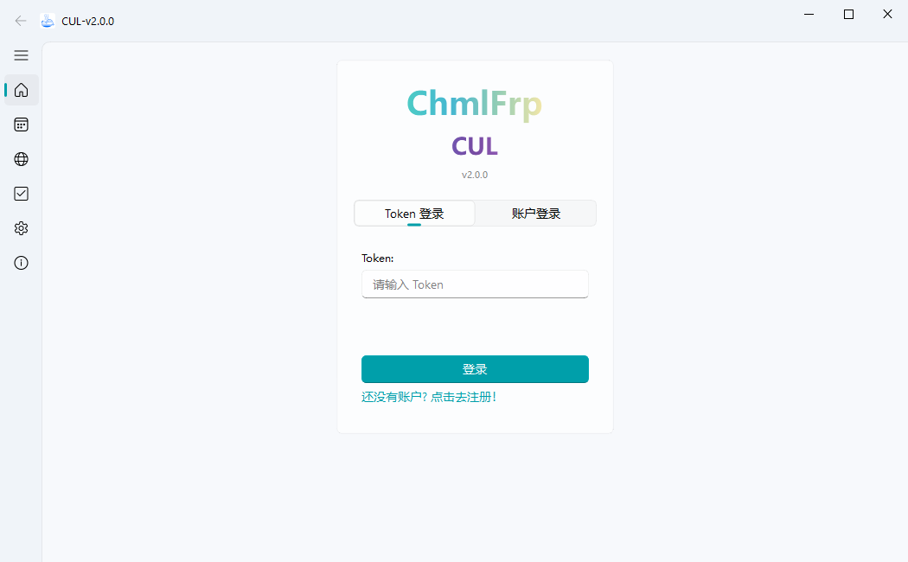

### 登录界面（已登录）
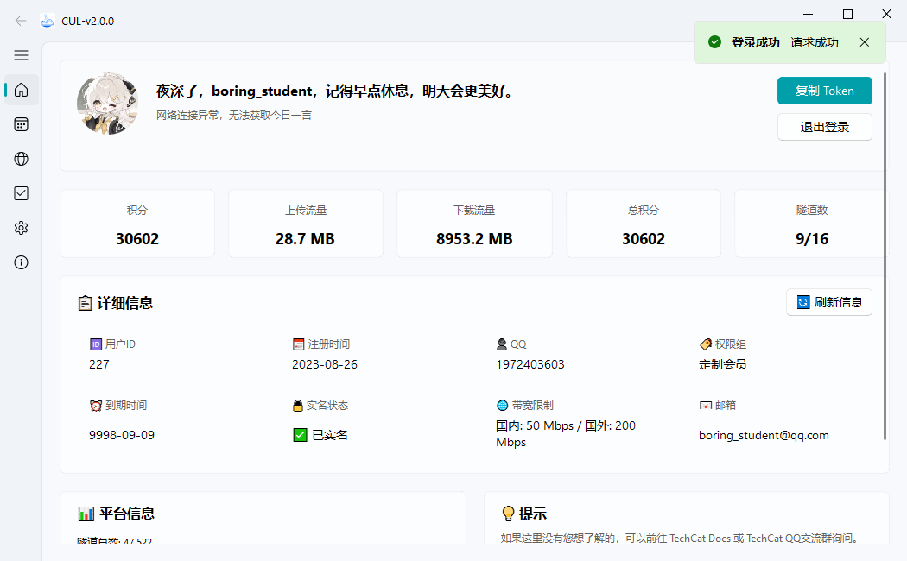

### 隧道界面
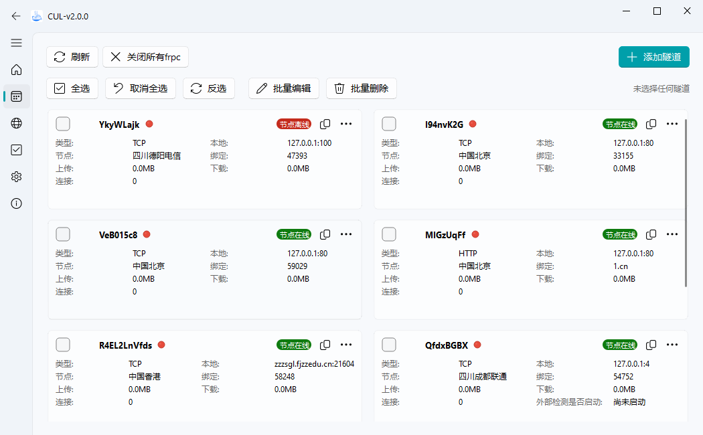

### 隧道界面-添加
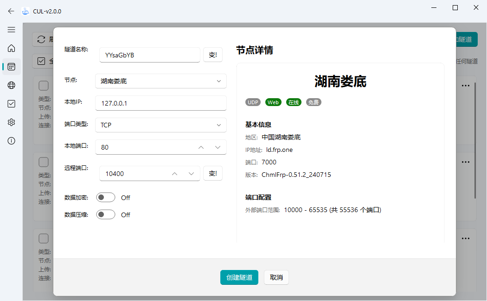

### 隧道界面-编辑
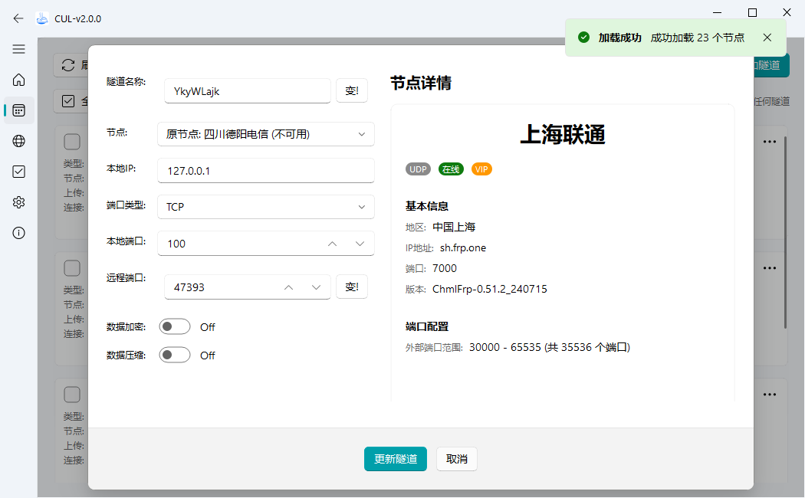

### 隧道界面-批量编辑
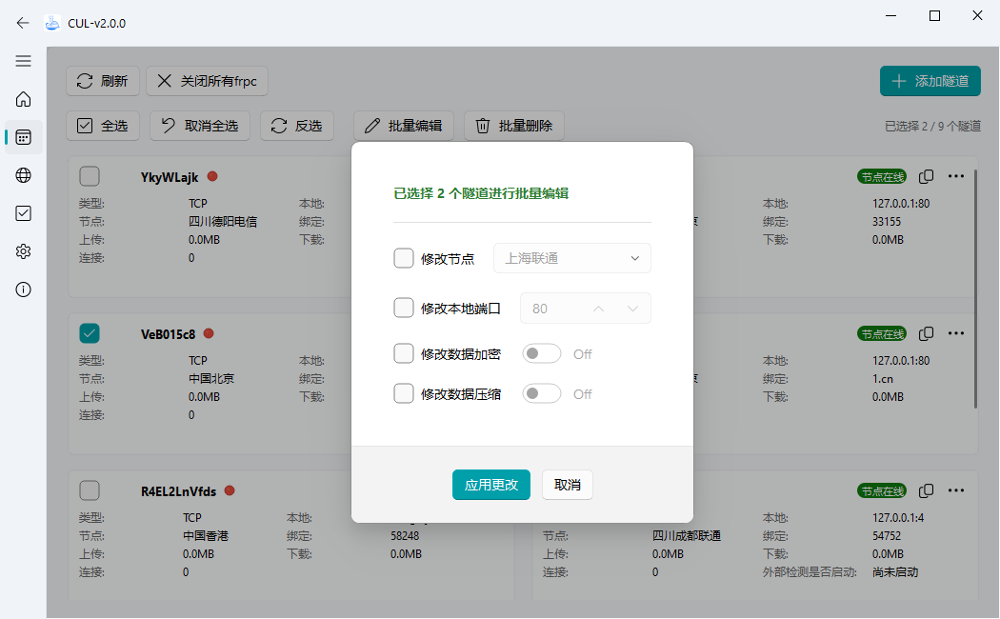

### 隧道界面-frpc日志查看
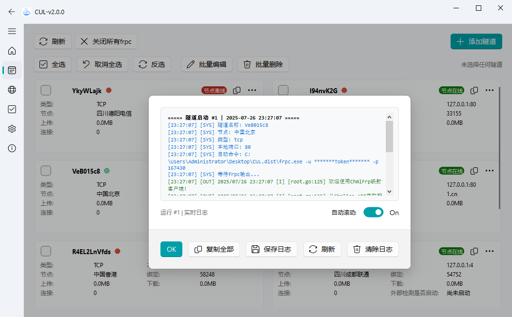

### 域名界面

### 域名界面-添加
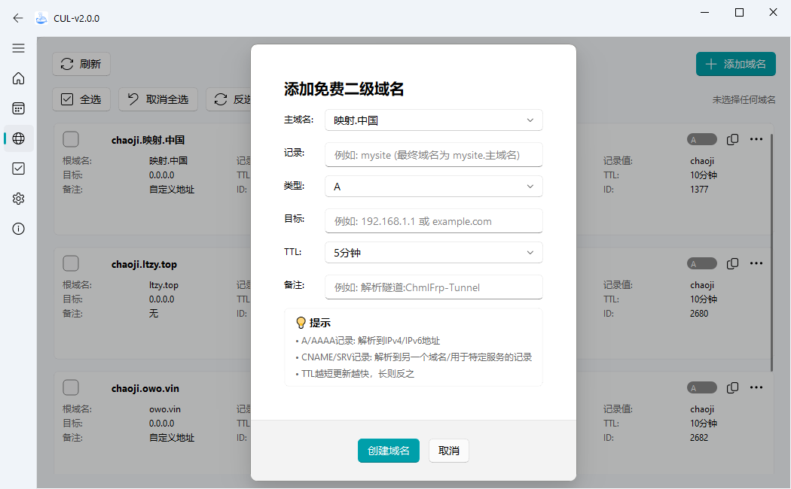

### 域名界面-编辑
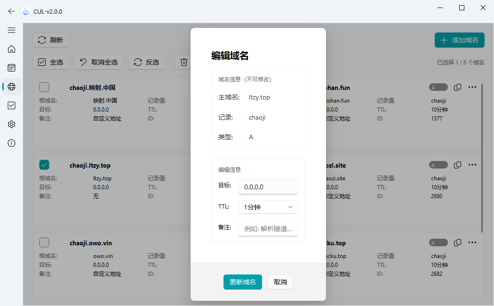

### 节点界面
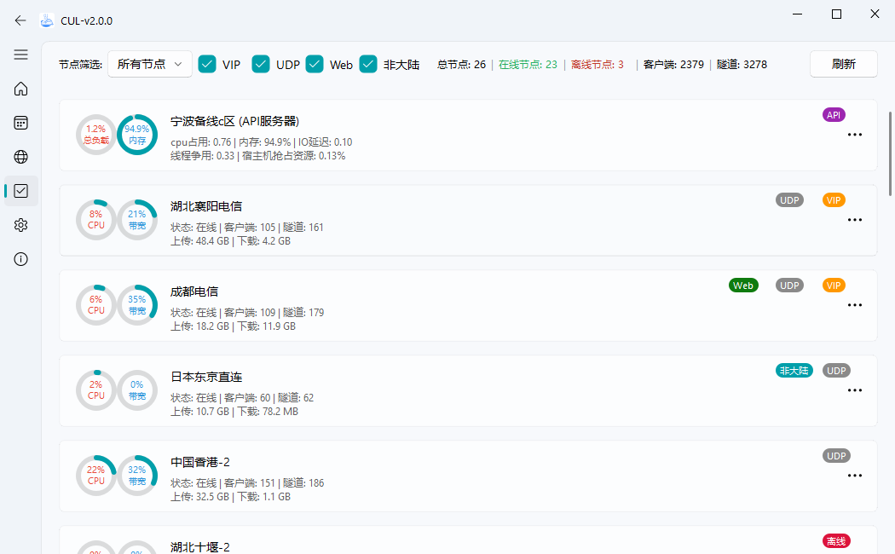

### 节点界面-在线率
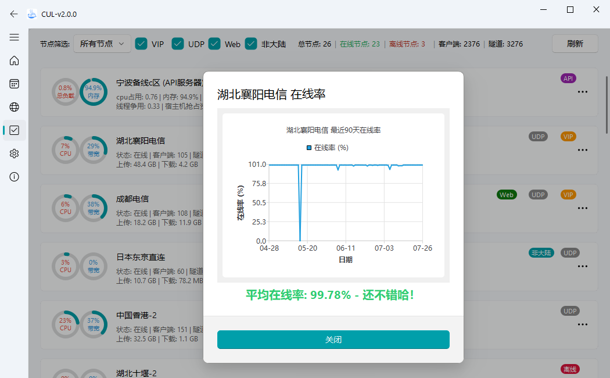

### 节点界面-详细

### 设置界面
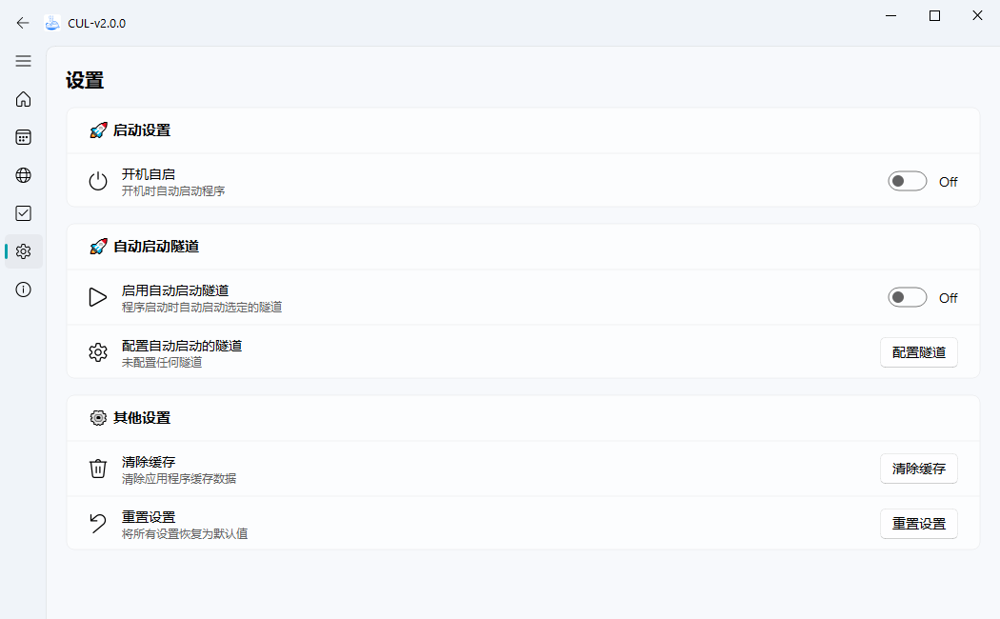

### 设置界面-自启动隧道配置
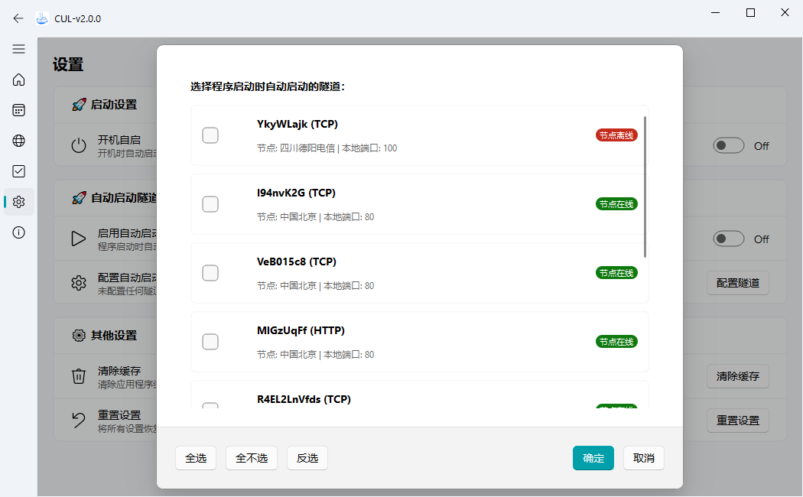

### 关于界面
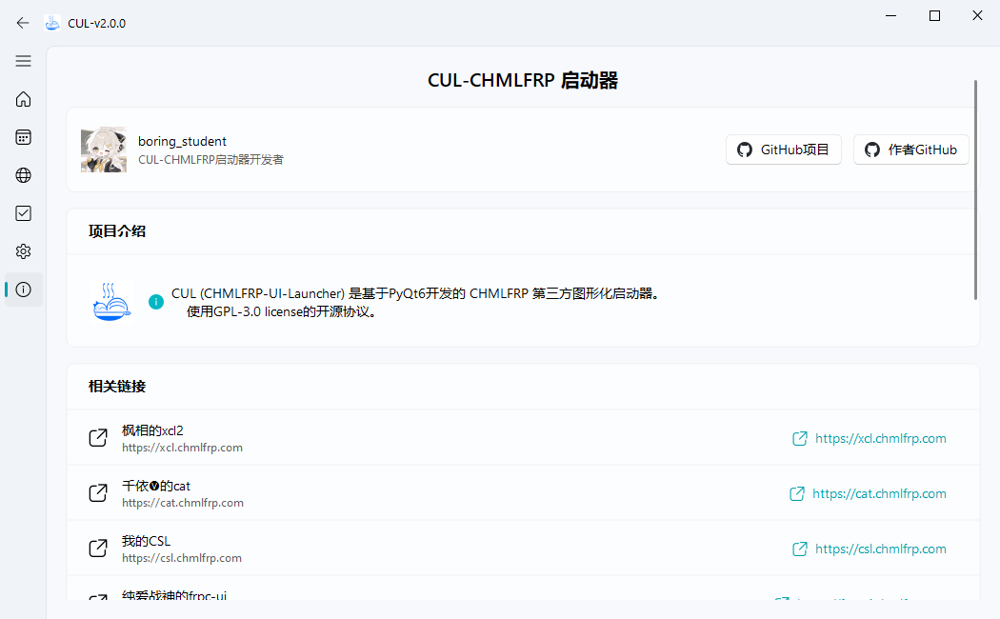
