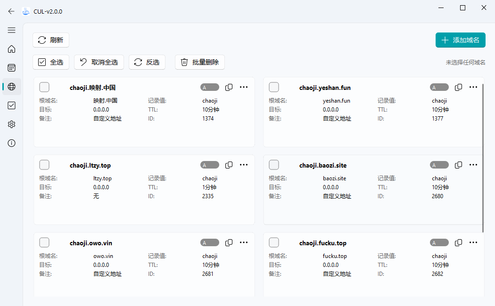
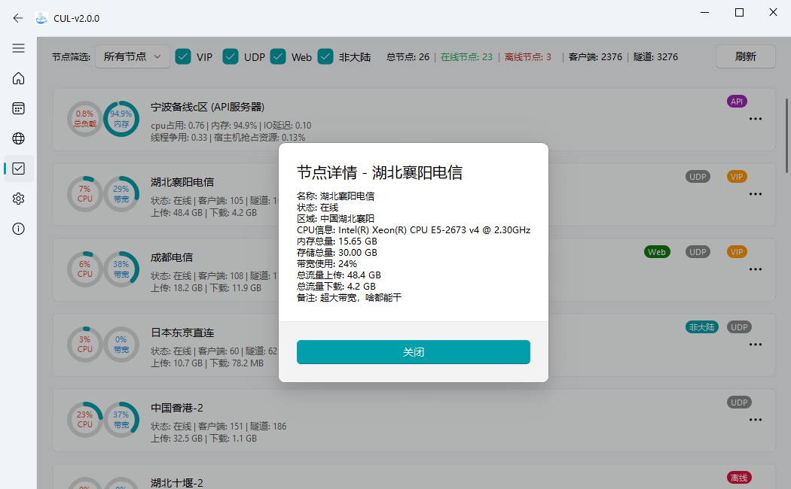

# cul2.0预览

### 登录界面（未登录）

### 登录界面（已登录）

### 隧道界面

### 隧道界面-添加

### 隧道界面-编辑

### 隧道界面-批量编辑

### 隧道界面-frpc日志查看

### 域名界面

### 域名界面-添加

### 域名界面-编辑

### 节点界面

### 节点界面-在线率

### 节点界面-详细

### 设置界面

### 设置界面-自启动隧道配置

### 关于界面

